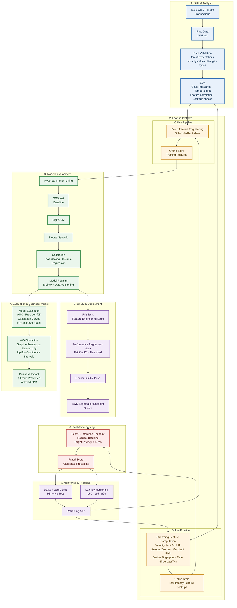

# End-to-End Fraud Detection ML Pipeline

> A production style machine learning pipeline for real time payment fraud detection, covering data validation, feature engineering, model development, evaluation, CI/CD, real time inference, monitoring, and automated retraining.

---

## 🏗️ ML Architecture



---

## 🔄 Main Flow

```
Raw Data
   ↓
Data Validation
   ↓
EDA
   ↓
Feature Engineering
   ├── Batch Features ──→ Offline Store ──→ Model Training
   └── Streaming Features ──→ Online Store ──→ Real-time Inference
                                                      ↓
                                                  FastAPI
                                                      ↓
                                             Fraud Prediction
                                                      ↓
                                               Monitoring
                                               ├── Drift
                                               └── Latency
                                                      ↓
                                             Alert / Retraining
                                                      ↓
                                             Feature Pipeline
```

---

## 🧠 Model Development

The training workflow compares multiple model families before calibration and registration.

```
Hyperparameter Tuning
        ↓
     XGBoost
        ↓
     LightGBM
        ↓
  Neural Network
        ↓
    Calibration
        ↓
   MLflow Registry
```

- **XGBoost** — baseline gradient-boosted model
- **LightGBM** — alternative gradient-boosting model
- **Neural Network** — non-linear modelling benchmark
- **Calibration** — Platt scaling and isotonic regression

> The final model is selected using predictive performance and business impact, rather than AUC alone.

---

## 📊 Evaluation

### Model Metrics
| Metric | Description |
|---|---|
| AUC | Area under the ROC curve |
| Precision@K | Precision at top K predictions |
| Calibration curves | Reliability of predicted probabilities |
| FPR at fixed recall | False-positive rate at a defined recall level |
| KS statistic | Separation between fraud and non-fraud distributions |
| PSI | Population Stability Index for drift detection |

### Business Metrics
| Metric | Description |
|---|---|
| Fraud prevented (£) | Estimated monetary value of detected fraud |
| False positives | Volume of legitimate transactions incorrectly flagged |
| Detection rate | Proportion of actual fraud cases caught |
| Uplift vs baseline | Performance improvement over the rule-based baseline |
| Operational impact | Effect on manual review workload |

> An A/B simulation compares modelling approaches including graph enhanced versus tabular only features with confidence intervals around estimated uplift.

---

## 🧪 Data Validation

Data quality checks are performed before model development using **Great Expectations**:

- Missing-value checks
- Data-type and range validation
- Feature distribution checks
- Temporal drift checks
- Correlation analysis
- Data leakage checks
- Class-imbalance analysis

---

## ⚙️ Feature Platform

The architecture separates offline and online feature computation.

### Offline Features
Batch feature engineering is scheduled with **Airflow** and written to an offline store for model training. Example features include historical transaction aggregates, customer behaviour, merchant statistics, transaction frequency, and rolling-window features.

### Online Features
Real-time feature computation supports low-latency fraud scoring. Example features include:
- Transaction velocity over 1m / 5m / 1h
- Amount Z-score
- Merchant risk score
- Device fingerprint
- Time since last transaction

The **online store** (Redis) provides low-latency feature lookups during inference.

---

## 🚦 CI/CD

```
Model Registry
      ↓
 Unit Tests
      ↓
Performance Gate
      ↓
 Docker Build
      ↓
 AWS Deployment
      ↓
 FastAPI
```

Quality checks include:
- Feature engineering unit tests
- Model performance threshold gate (fails pipeline if AUC falls below threshold)
- Container build verification
- Deployment readiness checks

> A model that fails the defined performance threshold does not progress to deployment.

---

## ☁️ Deployment & Serving

```
MLflow Model Registry
        ↓
   GitHub Actions
        ↓
    Docker Build
        ↓
AWS SageMaker / EC2
        ↓
      FastAPI
        ↓
  Fraud Prediction
```

The serving layer:
- Targets latency under 50ms (design target)
- Supports request batching
- Returns a calibrated fraud probability

---

## 📡 Monitoring

### Drift Monitoring
Incoming features are monitored using:
- **PSI** — Population Stability Index
- **KS test** — Kolmogorov–Smirnov test

### Latency Monitoring
- p50 latency
- p95 latency
- p99 latency

---

## 🔁 Automated Retraining

```
Production Traffic
       ↓
Feature / Data Monitoring
       ↓
PSI / KS Threshold Breached
       ↓
Retraining Alert
       ↓
Feature Engineering
       ↓
Model Training
       ↓
Evaluation
       ↓
Performance Gate
       ↓
Docker Build
       ↓
Deployment
```

> Data → Features → Model → Evaluation → Deployment → Monitoring → Retraining

---

## 🧰 Technology Stack

| Layer | Technologies |
|---|---|
| Data | Python, SQL, AWS S3 |
| Data validation | Great Expectations |
| Feature engineering | Python, Airflow |
| Feature store | Redis |
| Machine learning | Scikit-learn, XGBoost, LightGBM |
| Explainability | SHAP |
| Experiment tracking | MLflow |
| Data versioning | DVC |
| API | FastAPI |
| Containerisation | Docker |
| CI/CD | GitHub Actions |
| Cloud | AWS SageMaker / EC2 |
| Monitoring | PSI, KS, latency monitoring |

---

## 📁 Project Structure

```
Real-Time-Payment-Fraud-Detection-System/
    .github/
        workflows/
            ci.yml
    api/
        main.py
    src/
        evaluate.py
        feature_engineering.py
        predict.py
        preprocessing.py
        train.py
        utils.py
    tests/
        test_api.py
        test_model.py
        test_preprocessing.py
    data/
        raw/
        processed/
    models/
    .gitignore
    Dockerfile
    README.md
    requirements.txt
```

---

## 🚀 Getting Started

### Prerequisites
- Python 3.9+
- Docker
- AWS CLI (for cloud deployment)

### Run locally

```bash
# clone the repo
git clone https://github.com/Oluwanifemmi/Real-Time-Payment-Fraud-Detection-System.git
cd Real-Time-Payment-Fraud-Detection-System

# install dependencies
pip install -r requirements.txt

# train the model
python src/train.py

# run tests
pytest tests/

# start the API
uvicorn api.main:app --host 0.0.0.0 --port 8000
```

### Run with Docker

```bash
docker build -t fraud-detection .
docker run -p 8000:80 fraud-detection
```

### API usage

```bash
curl -X POST "http://127.0.0.1:8000/predict_probability" \
  -H "Content-Type: application/json" \
  -d '{"AMT_CREDIT": 250000, "EXT_SOURCE_1": 0.78, ...}'
```

---
